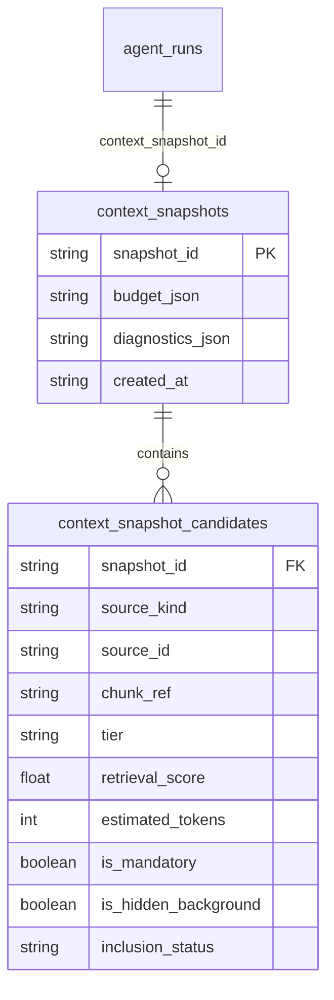

# Agent Phase 3: Context Snapshot Design v1.0

## Objective

Design the persistent Context Snapshot model that bridges Context Selection and the Context Manager. This model provides a durable, auditable record of how prompts are assembled—capturing why candidates were selected, budgeting decisions, and diagnostic telemetry—without duplicating prompt text or raw content.

This document is **architecture only**. No implementation, migrations, or Rust code changes occur under this plan.

## 1. Context Snapshot Architecture

A Context Snapshot is an immutable, durable record of the context assembly pipeline for a single Agent Run. It acts as the bridge between candidate generation and token budgeting.

### What it stores:
- **Identity References**: Pointers to the source material (`source_kind`, `source_id`, `chunk_ref`).
- **Selection Metadata**: Tiers, scores, mandatory flags, and hidden background rules.
- **Budgeting Metadata**: Token estimates before and after budgeting, and final inclusion/rejection decisions.
- **Diagnostics**: A privacy-scrubbed subset of telemetry from the scope, retrieval, and selection phases.

### What it does NOT store:
- Full candidate content.
- Assembled prompt text.
- Provider envelopes or payloads.

## 2. Snapshot Boundaries

- **Context Selection**: Outputs a prioritized list of retrieval and graph candidates. The snapshot captures these candidates' identities, their intended tiers, and initial scores.
- **Context Manager**: Consumes the selection list, applies the token budget, and finalizes the prompt. It enriches the snapshot by marking each candidate's final status (`included`, `dropped_budget`, `dropped_policy`) and recording budget math.
- **Agent Run**: References the snapshot via the already-reserved `agent_runs.context_snapshot_id` column.

## 3. Persistence Strategy

**Decision: Hybrid Persistence (References + Relational Rows)**

We reject storing full selected content (violates deduplication and risks privacy bloat). We reject a single monolithic JSON blob for candidates because it prevents efficient auditing ("Which agent runs used memory X?").

**Strategy**:
- Store the snapshot metadata (budget, diagnostics) as a structured JSON blob in a parent table.
- Store the selected candidates as individual relational rows pointing back to SQLite canonical identities.

*Evaluation*:
- **Privacy**: High. Content remains in canonical tables guarded by existing privacy rules.
- **Storage Growth**: Low. Only metadata and foreign-key-equivalent strings are stored.
- **Replayability**: High. The exact state of the context pipeline can be reconstructed by re-fetching the referenced chunks.
- **Auditability**: High. Relational candidate rows enable fast queries for provenance.

## 4. Candidate Model

Each candidate evaluated by the Context Manager must be recorded with the following mandatory fields:

- `snapshot_id`: Foreign key to the parent snapshot.
- `source_kind`: e.g., `response`, `memory`, `attachment_chunk`.
- `source_id`: Canonical SQLite ID.
- `chunk_ref`: Deterministic chunk identity.
- `tier`: The context tier (e.g., core, relevant, background).
- `retrieval_score`: The fusion/hybrid score before budgeting.
- `estimated_tokens`: Token cost computed during selection.
- `is_hidden_background`: Boolean mapping to Weft background rules.
- `is_mandatory`: Boolean indicating forced inclusion.
- `inclusion_status`: Enum (`included`, `dropped_budget`, `dropped_policy`, `error`).

## 5. Budget Model

The `ContextBudgetSnapshot` is serialized as JSON in the parent snapshot row. It captures the mathematics of prompt assembly without the prompt text itself:

- `estimated_tokens_before`: Total tokens of all candidates presented by Selection.
- `estimated_tokens_after`: Total tokens of candidates successfully included.
- `budget_limit`: The maximum token ceiling enforced for the run.
- `candidates_presented`: Count of candidates evaluated.
- `candidates_included`: Count of candidates passing the budget.
- `candidates_rejected`: Count of candidates dropped.
- `rejection_reasons`: Aggregated map of reasons (e.g., `{"budget_exceeded": 5, "policy_exclusion": 1}`).

## 6. Diagnostics Model

The snapshot aggregates privacy-safe telemetry from upstream pipeline stages:

- **Scope Resolution Diagnostics**: Number of active looms traversed, graph depth, cycle detection events.
- **Retrieval Diagnostics**: Engines queried (e.g., FTS5, Tantivy, LanceDB), fallback events, query latencies.
- **Selection Diagnostics**: Fusion strategy used, weighting applied, memory policy interventions.

*Note: No query text or candidate text is permitted in these diagnostics.*

## 7. Replay Model

To support the future Agent Inspector UI, the replay flow operates as follows:

1. **Load Run**: User opens an Agent Run in the inspector.
2. **Fetch Snapshot**: Retrieve the `ContextSnapshot` and its associated `SnapshotCandidates`.
3. **Rehydrate Content**: The inspector queries the canonical SQLite tables (`responses`, `memories`, etc.) using the `(source_kind, source_id, chunk_ref)` tuples to fetch the text *as it exists today*.
4. **Display**: Render the context timeline, showing exactly which candidates were included, which were dropped, and the token math that led to the final prompt.

## 8. Privacy Model

This model inherits and enforces the "Raw thinking must never be stored" rule:

- **Never enters snapshot**: Raw thinking, chain-of-thought, provider deltas, prompt text, tool execution output, API keys.
- **Safe to persist**: Identifiers (`source_id`), numerical scores, token estimates, enum statuses, and routing metrics.

Because the snapshot only stores references to SQLite, it cannot leak content that SQLite itself already rejected.

## 9. Relationship Model

**Decision**: A hybrid approach. A root `context_snapshots` table holds the aggregate JSON metadata, and a relational `context_snapshot_candidates` table holds the individual items to allow cross-run candidate auditing.

## 10. Future Compatibility

- **Memory Policy Engine**: Compatible. Memory policy overrides simply update the candidate's `inclusion_status` or `is_mandatory` flags before budgeting.
- **Tool Runtime & MCP**: Compatible. Tools injected into context act as another `source_kind` (e.g., `tool_descriptor`).
- **Multi-Agent**: Compatible. Snapshots are scoped to an `AgentRun`, allowing hierarchical or parallel runs to maintain distinct context boundaries.
- **Weft**: Compatible. The `is_hidden_background` flag natively models Weft lineage rules.

## 11. Final Recommendation

- Adopt the **Hybrid Persistence** model (relational candidates + JSON metadata).
- Future implementation will introduce two migrations: `context_snapshots` and `context_snapshot_candidates`.
- Proceed with Phase 3 execution based on this design. No codebase changes are authorized until implementation tasks are explicitly created and approved.
