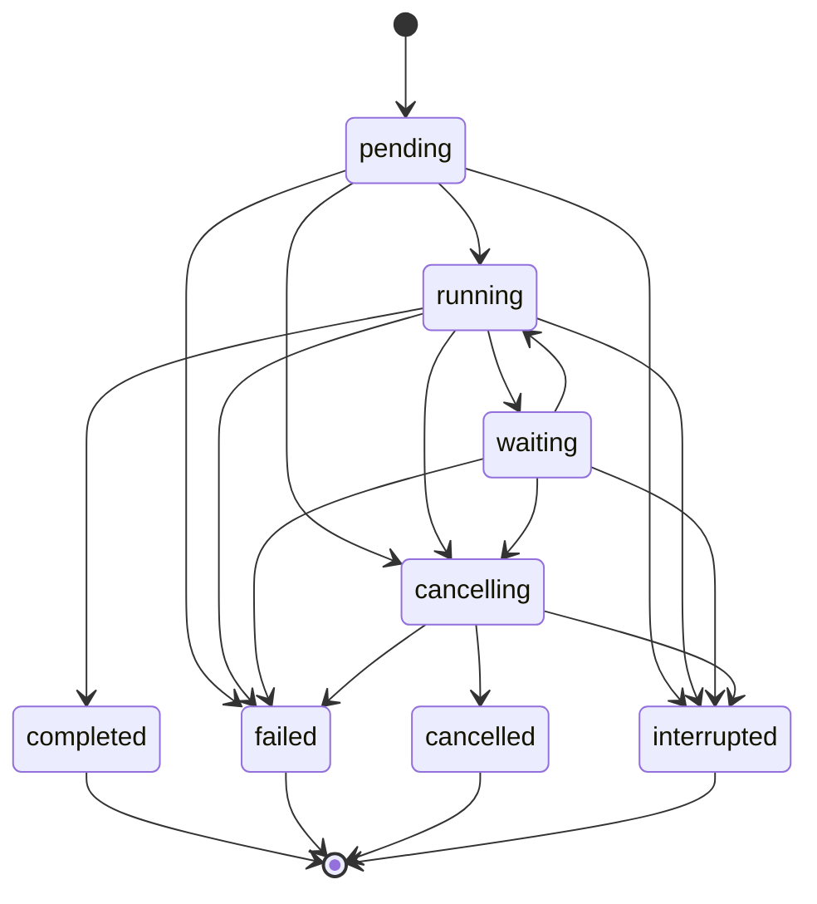

# Agent Runtime State Machine

Status: Canonical design freeze
Task: `AGENT-RUNTIME-CONTRACT-FREEZE-001`

## 1. RunState

```text
pending       accepted but execution has not started
running       actively executing one or more Steps
waiting       execution is suspended on a declared dependency
cancelling    cancellation was accepted before a terminal commit
completed     successful terminal outcome
failed        unsuccessful terminal outcome with a safe error
cancelled     cancellation terminal outcome
interrupted   executor ownership was lost; outcome cannot be proven
```

`completed`, `failed`, `cancelled`, and `interrupted` are terminal. Terminal states are immutable.

`waiting` has a required reason:

```text
child_runs | tool_approval | tool_result | provider_capacity |
external_input | backoff | policy_gate
```

Waiting reason is metadata, not a new state. New wait reasons can be added without changing the state machine.

## 2. Canonical Transitions



Direct `pending -> cancelled` is represented as cancellation acceptance followed by immediate terminalization; implementations MAY commit both atomically without exposing `cancelling` externally.

## 3. Transition Table

| From | To | Required cause |
|---|---|---|
| `pending` | `running` | executor accepts ownership and emits run start |
| `pending` | `cancelling` | cancellation accepted before start |
| `pending` | `failed` | validation, policy, or scheduling failure |
| `pending` | `interrupted` | ownership lost before start outcome is known |
| `running` | `waiting` | declared dependency blocks progress |
| `waiting` | `running` | dependency resolves and ownership remains valid |
| `running`, `waiting` | `cancelling` | cancellation accepted before terminal commit |
| `running` | `completed` | all required Steps and join policies succeed |
| `running`, `waiting` | `failed` | unrecoverable safe failure committed by runtime |
| `running`, `waiting` | `interrupted` | executor ownership lost and recovery cannot prove outcome |
| `cancelling` | `cancelled` | active work quiesces or cancellation deadline expires |
| `cancelling` | `failed` | cleanup or safety failure prevents a clean cancelled outcome |
| `cancelling` | `interrupted` | executor ownership is lost during cancellation |

All other transitions are invalid.

## 4. Transition Authority

1. The Agent Runtime is the only authority that commits Run transitions.
2. Providers, Tools, Context services, and child runs report events or results; they do not mutate Run state.
3. A transition uses compare-and-set semantics against the current state.
4. Exactly one terminal transition can succeed.
5. The terminal state and terminal Agent Event MUST commit atomically in durable storage, or be recoverable as one logical operation.
6. A terminal Event is the final Event in that run's sequence. Late adapter output is ignored or quarantined.

## 5. Cancellation Race Rules

Cancellation is a request until accepted by the runtime.

- If a terminal transition commits before cancellation acceptance, the terminal state wins and cancellation is an idempotent no-op.
- If cancellation is accepted first, the run enters `cancelling`; normal completion is no longer valid. The run terminates as `cancelled`, `failed`, or `interrupted`.
- Repeated cancellation requests do not create repeated state transitions or terminal Events.
- Cancellation may be best-effort at provider or Tool transport level, but Run cancellation semantics remain service-owned.
- Partial visible output may remain in canonical Response storage with cancelled metadata. It does not make the Run completed.

## 6. Cancellation Contract

```text
CancellationRequest {
  request_id: string
  target_run_id: AgentRunId
  scope: run_only | run_and_descendants
  requested_by: user | parent_run | runtime | operator | shutdown
  reason_code: optional stable code
  requested_at: instant
}

CancellationState {
  requested: boolean
  accepted_at: optional instant
  requested_by: optional enum
  scope: optional enum
  reason_code: optional stable code
}
```

Rules:

1. User-facing cancellation defaults to `run_and_descendants`.
2. Internal orchestration MAY cancel one child with `run_only`.
3. Subtree cancellation is delivered to every non-terminal descendant known at acceptance time. A new child MUST NOT be spawned after its ancestor enters `cancelling`.
4. Child cancellation does not propagate upward unless an explicit orchestration policy fails or cancels the parent.
5. Cancellation of an unknown run returns not found without creating state.
6. Cancellation of a terminal run returns its unchanged state and `accepted=false`.
7. Cancellation responses contain identifiers, state, and safe codes only.

## 7. Parent and Child Lifecycle

1. Creating a SubAgent delegation creates a new child Run in `pending`.
2. The parent MAY remain `running` for parallel work or enter `waiting` according to join policy.
3. Child terminalization emits a child terminal Event in the child stream and one safe child-outcome Event in the parent stream.
4. `wait_for_all` resumes the parent only when all joined children are terminal.
5. `wait_for_any` resumes when one qualifying child outcome is available; remaining children follow explicit policy and are not silently abandoned.
6. `detached` children retain ownership links and receive ancestor subtree cancellation.
7. Parent completion requires every non-detached required child to satisfy its join policy.
8. A parent terminal transition never rewrites a child's terminal outcome.

## 8. Step and Tool Effects

- Starting a Step requires the Run to be `running`.
- A Step waiting on approval, a Tool Result, or children moves the Run to `waiting` only when no other runnable Step can make progress.
- A Tool denial or skip terminalizes the Tool Invocation, not necessarily the Run.
- Tool failure affects Run state only through the owning orchestration policy.
- A Tool Invocation cannot start or finish after its Run is terminal.
- On Run cancellation, active Steps and Tool Invocations are cancelled or failed before the Run terminal Event is committed, subject to the cancellation deadline.

## 9. Context Preconditions

Before the first provider call or Context-consuming Tool call:

1. Context Selection and Context Manager finish their work.
2. The Context Snapshot is finalized.
3. The Snapshot is linked to the Run.
4. Mandatory Context overflow fails the Run explicitly.

A declared no-context Run records `context_snapshot_id = null` and a safe policy reason. It MUST NOT silently skip a required Context build.

## 10. Interruption and Recovery

`interrupted` means the runtime cannot prove whether active external work completed. It is terminal for the original Run.

- Startup recovery marks orphaned `pending`, `running`, `waiting`, or `cancelling` runs interrupted when ownership cannot be recovered.
- Recovery emits exactly one `run.interrupted` terminal Event.
- Resumption creates a new Run with a new ID and causation reference to the interrupted Run.
- External idempotency keys MAY prevent duplicate provider or Tool side effects, but never reopen the original Run.

## 11. Invariants

1. One Run, one current state, one terminal state, one terminal Event.
2. State transition order and Event sequence order agree.
3. Parent/child links are immutable and acyclic.
4. No child starts after an ancestor cancellation is accepted.
5. Provider or Tool transport failure cannot bypass runtime transition authority.
6. Raw thinking, secrets, provider envelopes, and raw Tool output never participate in state decisions or durable transition metadata.
